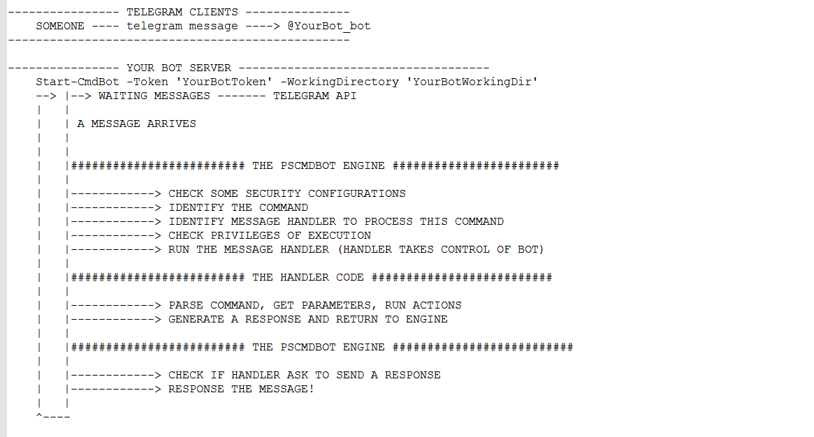

# PsCmdBot

PsCmdBot is a powershell module that provides a rich platform to allow a telegram bot execute many tasks, like connecting to databases and executing SQL commands, running powershell scripts, interaction with operating system, etc.

The PsCmdBot provides a powerful engine that handles many operation, provies integration with telegram, handles security, generate useful logging for debugging, manages configurations files, etc.

Also, the main power os PsCmdBot is allow a form of "plugins" (we calls it "message handlers") be added to it. When you start a PsCmdBot, it do not many useful things... It provides just a set of basics commands to obtain information about chat and configure your bot. 

But, you can search for a message handler on internet, use a message handler that we provide, or, write you own.

## The basic flow

* You create a telegram bot and get a token (talking with @botfather)
* You download the PsCmdBot module
* You start a powershell session and import the module:
```powershell
import-module PsCmdBot -force;
```
* You create a directory (the working directory of your bot). Example: C:\MyBot
* You can define a configuration file (must be named .config.ps1 in working directory): C:\MyBot\.config.ps1
* You set security options in configuration file
* You can add additional message handlers in you working directory: Just put the *.msghandler.ps1 in C:\MyBot\msghandlers
* You start you bot:
```powershell
Start-CmdBot -token 'MyBotToken' -WorkingDirectory C:\MyBot
```
* Now, your bot is able to process a lot of commands and response them!

### Macro Flow




## The Message Handlers

Message handlers are the way your extended the power of your bot.
It are simple powershell scripts that define many information about the it, and, of course,  the code it will execute whenever a command for it is sent to your bot.

If you are a IT Administrator that want allow manage your infraescruture via telegram bot, you can search for message handlers that do actions of your interest. Its important note that message handlers are just code a another team or people write. You must get trusth code and, if possible, review the code to guarantee that is not mailicious.

If you are a message handler writer, then you can use documentation and PsCmdBot features to help you write the code for you want.  The PsCmdbot engine handles many things. It provides default actions and features. Most of them, you can customize to acieve a maximum of customization to your solution. Following items are some features that PsCmdBot engines proved by default:


### Message Handlers EXamples

The [documentation of message handlers](doc/MESSAGEHANDLERS.md) contains lot of information for developing your handler.
Also, check the [message handlers examples](messagehandlers/examples) for more ideas.


## Main Features

* **A default command parse (DCP)**
With DCP, you dont need worry about write a interpreter to your bot commands.
The DCP takes the command message sent by user in telegram, and extract parameters, strings , arrays etc. It provides the values in native powershell objects!
Read more in [DCP documentation](doc/DCP.md)

* **A default authorization check**
Security is a important topic inside PsCmdBot engine. Because you allowing the any user in the World sent commands to your bot, we provide a basic security mechanism. By default, only explicity authorized users can execute any command of thridy party handlers. You authroized users using the configuration file in working directory.
Also, the PsCmdBot engine provides another configuratons options to control chats that can send commands, super admins, etc.

* **Configurations Files**
The PsCmdBot engine provies a rich and powerfull model of configuration. If you are a handler write, you can define default options that your message handler will need. The user, them, can change this values using a configuration file in working directory or via runtime. Configuration can be changed in runtime, allowing bot change behavior in any time.
Configuratons are powershell script that returns a hashtable. This facilitates user read of configuration and implementation of it.
Read more in [configuration file documentation](doc/CONFIGURATIONFILE.md)


* **Logging**
THe PsCmdBot uses the [XLogging](https://github.com/rrg92/XLogging) powershell modules. That its, it can logs messages to files, console, etc. You can control many logging options in configuration files.


