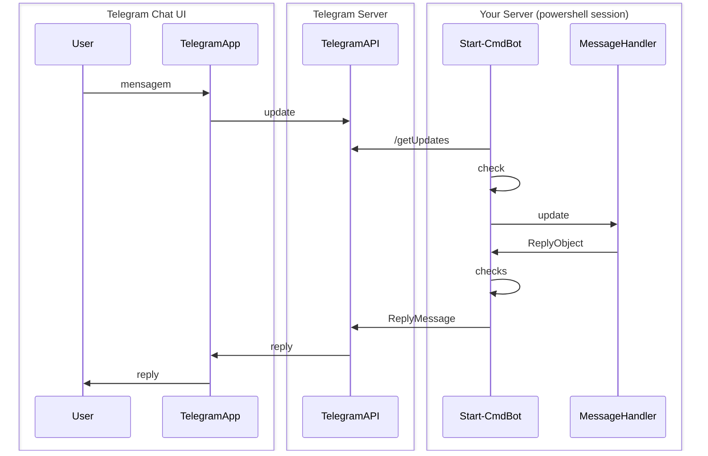

# PsCmdBot

PSCmdBot é um módulo powershell que provê um jeito bem fácil de integrar bots do Telegram no seu script.  
Você pode enviar e responer mensagens usando scripts powershell!
E há uma série de configurações que ajudam a controlar diversos aspectos, incluindo a segurança desses scripts e mensagens!

## Como começar 

Abaixo um passo para começar a receber e responder mensagens:

### Obtenha um token 

Para obter o token, você deve iniciar um conversa com o usuário [@BotFather](https://t.me/botfather).  
Envie o comando `/newbot` e siga as instruções.
Se você já tem um token previamente criado, é só usar ele.

### Crie o BotDir (WorkingDir)

O BotDir é o diretório one todas as configurações e scripts do seu bot ficarão.  
Você pode criar manualmente, mas recomendo usar o comando `Set-CmdBotDir`.  
É só invocar ele passando um caminho. Se for um diretório existente, ele irá validar e criar dentro.  
Se não existir, ele cria. Você pode especificar diretórios usando caminhos relativos. Por exemplo, `Set-CmdBotDir .`, cria no diretórioa atual.

### Crie um Message Handler

Uma vez que você criou o BotDir, você deve criar um arquivo com a extensão `.msghandler.ps1` no diretório `BotDir\msghandlers`.  
O nome que você especifica (antes do .msghandle), é o nome do seu handler, e este nome você vai referenciar na configuração.

Este é o arquivo que vai ser invocado quando o usuário enviar mensagens.  
Aqui está um exemplo de um Message Handler que responde qualquer mensagem com a quantidade de caracteres da mensagem atual.


```powershell 
# msghandle\echo.msghandler.ps1
# Nome do handler: echo
@{

	HANDLER = {
		param($res, $update)
		
		$TotalChars = $update.text.length;
		$res.mustReply = $true;
		$res.reply.message = "Caracteres: $TotalChars";
	}

}
```


### Defina as configurações de segurança 

Agora que você definiu o handler, você configurar o seu bot e autorizar usuários.  
Você faz no arquivo `config.ps1` que fica na raiz do seu Botdir.
Aqui está um exemplo:

```
@{
	GLOBAL = @{
		SECURITY = @{
			#Especifie um ou mais usuarios!
			#Para autorizar grupos, coloque o id do grupo (adicone o bot no grupo e use o comando /chatinfo para obter o id.
			USERHANDLERS_CHATS = @('@telegramusername')
		}
	}
	
	HANDLERS = @{
		echo = {
			COMMANDS = @{
				'echo' = @{
					AUTHORIZED_USERS = '*'
				}
			}
		}
	}
}
```


### Execute!

Agora que você tem tudo configurado, incie o seu bot com o comando Start-CmdBot:

```
# especifique o token obtido com o botfather 
# Especifique o working directory (ou pode omitir se estiver no atual)
Start-CmdBot -token 'MyBotToken' -WorkingDirectory C:\MyBot
```


## Fluxo 

Aqui está um diagrama mostrando o fluxo de mensagens entre o Telegram e o PsCmdBot



## BotDir 

BotDir (também chaamdo de WorkingDir), é o diretório do seu bot, onde você deve armazenar configurações e scripts, e onde logs serão gerados.  
Você pode manualmente criar um ou usar o comando `Set-CmdBotDir`. Este cmdlet irá inicializar um diretório com todos os arquivos e estrutura necessária.

## Configuração 

O arquivo mais importante do seu BotDir é um chamado `config.ps1`. Este o `User Config File`, e é o arquivo que controla todos os aspectos do seu bot, incluindo a segurança. Este arquivo é um script powershell que deve retornar uma hashtable, com o seguinte formato:

```powershell 
@{
	CONFIG1 = VALUE
	
	CONFIG2 = @{
		CONFIG2_1 = value
		CONFIG2_2 = @{
		
			}
	}
}
```

Os valores das keys vão desde simples strings até tipos complexos, como hashtables ou scriptblock.
Para saber todas as opções possíveis, consulte o [DEFAULT CONFIG FILE](/default.config.ps1).  

As principais subkeys são GLOBAL (configurações válias para todos os handlers) e HANDLERS (configurações de handlers específicos).
O PsCmdBot identifica a alteração em runtime do arquivo, portanto você pode alterar enquanto ele está executando e as configurações valerão.  
Certas configurações podem ser aplicadas apens no start. Para saber quais são, consulte o default config file.

## Message Handlers

Message Handlers são scripts criados para processar mensagens recebidas.
Sempre que uma nova mensagem chega, o PsCmdBot identifica quais handlers podem processar aquela mensagem.  

Então, um a um, cada handler vai processar a mensagem, como se fosse em um pipeline.
A ordem em que os handlers são processados é defindo por configuração no arquivo de configuração do bot.

A ideia é que existam pessoas que escrevam handlers para que outras pessoas possam usar, criando um ecossistema de reaproveitamento, com as mais variadas funções.

### Doc e exemplos

Para criar um handler, você deve colocar um arquivo com a extensão `.msghandle.ps1` no diretório `BotDir\msghandlers\`.
O jeito mais rápido de criar um handler é através dos [exemplos](messagehandlers/examples).  
Para conhecer as opções avançadas, veja o arquivo de [layout.ps1](messagehandlers/layout.ps1), que contém toda a estrutura de como defniir um handler.

The [documentation of message handlers](doc/MESSAGEHANDLERS.md) contains lot of information for developing your handler.
Also, check the [message handlers examples] for more ideas.


## Outras features 

O PsCmdBot tem algumas outras features e conceitos, que vale um breve resumo:

* **default command parse (DCP)**
O PsCmdBot funciona interpretando mensagem como comandos.  
Para isso funcionar bem, criamos uma sintaxe chamada DCP (default command parse). 
Ele é um pequeno interpretador de mensagens e suporta uma série de recursos, como parâmetros, strings, etc.

* **Autorização**
Segurança é um assunto importante no PsCmdBot. Como qualquer usuário do mundo pode enviar comandos pro seu bot, há alguns mecanismos de segurança básica.  
Por padrão, somente usuário autorizados explicitamente, através do seu nome de usuário, podem enviar mensagens que serão processadas por Message Handlers de terceiro. Você autoriza esses usuários no arquivo de configuração do bot, localizado no BotDir. Há vários recursos que podem ser configurados que chegam até no nóivel de comando. Isso dá total controle para o admin.


